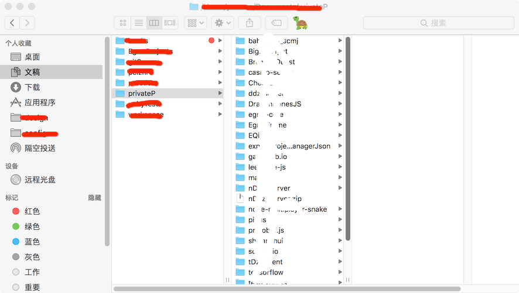
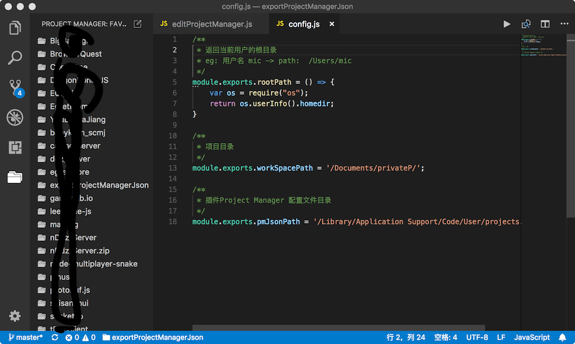

# exportProjectManagerJson

### 用途：
在VSCode 中有个 [Project Manager](https://github.com/alefragnani/vscode-project-manager)
插件，可以配置项目文件夹，但是每次新建项目必须手动配置项目路径以及名称。所以本脚本可以生成workspace下所有项目配置。目前只适合Mac Os系统。

---
### 使用方式：
- 在```config.js```文件中配置相对路径的项目目录

	```
	module.exports.workSpacePath = '/Documents/privateP/';

	```
- 在终端中运行```editProjectManager.js```文件

	```
	> node editProjectManager.js
	```	

---
### 效果：
#### 项目目录

#### VSCode效果

